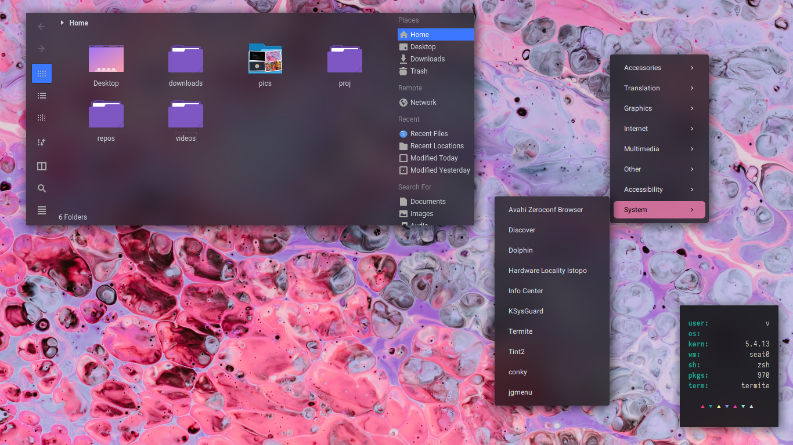

# Dots
My personal dotfiles. Feel free to clone and tweak

cello
---

<blockquote class="reddit-card" data-card-created="1586137820"><a href="https://www.reddit.com/r/unixporn/comments/er4pw5/oc_cello_so_i_decided_to_create_my_own_wm/">[OC] [ Cello ] So I decided to create my own WM</a> from <a href="http://www.reddit.com/r/unixporn">r/unixporn</a></blockquote>

A theme for cello, my own window manager. you get get it [here](https://github.com/vnteles/cellowm) to try **(unstable)**

**wm** : cello

**menu** : jgmenu

**terminal** : alacritty

**file manager** : dolphin

